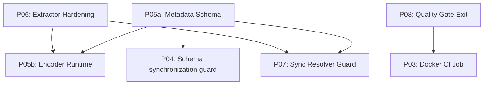

# PrisML — Public Roadmap

This document is the public-facing roadmap for PrisML. It captures prioritized fixes and implementation work planned for the project and is intended to help contributors and maintainers pick up well-scoped tasks. The technical details and acceptance criteria are included to make contributions actionable; if you plan to work on an item, open a PR that references the item ID and follow the contribution guidelines in `CONTRIBUTING.md`.

Overview
This document is a prioritized, actionable roadmap of fixes and future implementations for the PrisML project. Each item is scoped to be one PR-sized change (or a small set of PRs) with a concise description, affected files, priority, estimated effort, dependencies, and acceptance criteria.

**Dependency Graph (Critical Path):**

Note: the dependency graph shows primary technical dependencies only; cross-cutting dependencies (CI commit/push patterns, batching/operational interactions) are described in acceptance criteria for individual items. Additional critical/high items (for example: the trainer correctness fix, feature-order parity, and version-registry persistence) are defined below and their dependencies are expressed in each item; include them when planning execution.

How to use
- Pick an item, create a branch `fix/<id>-short-title` or `feat/<id>-short-title`, open a PR with the item id in the title (e.g. `#P01: Artifact lifecycle - define policy`), link to this file, and add the `roadmap` label.
- Keep each PR narrow: one behavior change + tests + docs (if applicable).

Legend
- Priority: Critical / High / Medium / Low
- Effort: S (<=2h) | M (2–8h) | L (>8h)
- Domain tags: [cli], [compiler], [runtime], [ci], [docs], [infra]

-------------------------------------------------------------------------------
Cross-cutting contracts
-------------------------------------------------------------------------------
- Logging responsibility: Logging responsibilities are split by domain — CLI/compiler logging is owned and implemented via the HIGH-priority items (`H01`, `H03`), while runtime logging is governed exclusively by `M10` (runtime logging contract) and MUST remain opt-in; runtime logs must not be enabled implicitly by CLI/compiler changes.

-------------------------------------------------------------------------------
CRITICAL (must decide/implement before stable release)
-------------------------------------------------------------------------------

Critical items include correctness, safety, and invariant-enforcement work required for a stable V1; these are non-optional hardening tasks that prevent silent data- or model-corruption in production.

P05a — Model Metadata Schema & Validation (Foundation)
- Priority: Critical — Effort: M
- Domain: [compiler][runtime]
- Owner: TBD — Est. Days: 2
- Dependencies: None
- Summary: Design and implement the schema for `metadata.json` (versioned) that defines input shapes (names, dtypes) and basic model info. Implement the runtime validator that checks input objects against this schema before inference.
- Files: `src/core/metadata.ts`, `src/runtime/validation.ts`, `docs/ARCHITECTURE.md`.
- Acceptance criteria:
  - Unit test `tests/unit/metadata-schema.test.ts` validates schema versioning (semver-like `version` field) and backwards compatibility.
  - `ONNXInferenceEngine` throws `ModelInputSchemaMismatchError` when validated against a mock metadata file with invalid inputs.
  - Metadata schema and rollback/migration strategy (how to handle incompatible updates) are documented in `docs/ARCHITECTURE.md`.
  - Metadata MUST include explicit ONNX I/O binding information: mapping from feature names to ONNX input tensor names/shapes and expected output tensor names. Unit test `tests/unit/metadata-onnx-mapping.test.ts` validates mapping format.
  - Runtime refuses to load an ONNX model if the `metadata.json` does not fully specify ONNX input/output bindings or if the session introspection reveals ambiguous/missing names (load-time failure with clear `ModelONNXBindingError`).
  - Metadata MUST also record training reproducibility information: `trainingSeed`, `trainerEnvironment` (python package names and versions used for training, e.g. scikit-learn, skl2onnx, xgboost), `pythonVersion`, and `trainerImageDigest` (if Docker used). Unit tests must validate these fields exist and are parsed by the runtime metadata validator.
  - Optional: `metadataSizeBytes` MAY be recorded at generation time to give immediate visibility into the size of `metadata.json` for telemetry and hot-path guidance. When present, tests should validate the field is a non-negative integer and CI size checks may use it for quick gating.
  - Documentation note: `metadata.json` may grow as features/encoders are persisted. Docs must clearly mark which fields are runtime-critical (ONNX I/O bindings, encoder checksums) and which are informational (train logs, metrics). Runtime-critical fields MUST be loadable into hot paths; large informational fields MUST be stored separately or lazily loaded and must not be loaded on the inference-critical code path.

P01 — Artifact lifecycle policy (enforce & tooling)
- Priority: Critical — Effort: S
- Domain: [infra][docs][ci]
- Owner: TBD — Est. Days: 1
- Dependencies: None
- Summary: Enforce "commit-to-repo" policy. Add tooling (CI lints, Git LFS recommendation) so the policy is followed consistently.
- Files: `prisml/README.md`, `prisml/.gitignore`, `scripts/check-artifact-size.sh`, `.github/workflows/ci.yml`.
- Acceptance criteria:
  - `scripts/check-artifact-size.sh` exists and fails if `prisml/generated/` contains files >50MB without override.
  - `.gitignore` explicitly allowlists `prisml/generated/`.
  - CI job `lint-artifacts` passes on current repo, fails if a dummy large file is added.
  - `docs/MIGRATION.md` includes git instructions for rolling back bad model artifacts (reverting commits).
  - CI push-safeguard: CI workflows that run `npx prisml train` MUST NOT create a self-triggering commit loop. Acceptable patterns include: pushing artifacts to a dedicated `models/` branch, using `[skip ci]` in commit messages, or using a token-scoped bot account that is excluded from retriggering the train job. Document the chosen pattern in `docs/MIGRATION.md` and verify with a CI smoke test.

P02 — Package exports/docs alignment
- Priority: Critical — Effort: S
- Domain: [docs][pkg]
- Owner: TBD — Est. Days: 0.5
- Dependencies: None
- Summary: Ensure `package.json` `exports` map matches public API documented in `docs/MIGRATION.md`.
- Files: `prisml/package.json`, `src/index.ts`.
- Acceptance criteria:
  - New smoke test `tests/smoke/npm-pack.test.ts` installs the packed tarball and successfully imports `defineModel`, `prisml` (extension), and `ONNXInferenceEngine`.
  - `dist/` contains only intended public modules.

P04 — Schema synchronization guard
- Priority: Critical — Effort: M
- Domain: [compiler][ci]
- Owner: TBD — Est. Days: 2
- Dependencies: P05a
- Summary: Prevent training/serve skew by verifying the Prisma Client / database schema used at `defineModel` time matches the connected database. This guard validates schema compatibility only; model/feature compatibility is enforced separately via metadata validation (P05a/M09).
- Files: `src/cli/commands/train.ts`, `src/compiler/analyzer/extractor.ts`.
- Acceptance criteria:
  - `prisml train` calculates and compares a **Prisma Client generation hash** (preferred source-of-truth) — falling back to Prisma schema file hash + migration history when client metadata is not available. The process documents which source was used.
  - Provide `--force`/`--skip-schema-check` opt-out for CI/advanced users with a WARNING in logs; default is strict check.
  - Integration test `tests/integration/schema-mismatch.test.ts` fails training when the effective source-of-truth indicates a mismatch between the code-generated client and connected DB.
  
P05b — Feature Encoding Persistence & Runtime
- Priority: Critical — Effort: M
- Domain: [compiler][runtime][ml]
- Owner: TBD — Est. Days: 4
- Dependencies: P05a
- Summary: Implement feature encoding strategies (one-hot, scale) in the Trainer and persist them into the `metadata.json` defined in P05a. Runtime applies these encodings deterministically.
- Files: `assets/python/trainer.py`, `src/runtime/engine/inference.ts`.
- Acceptance criteria:
  - Integration test `tests/integration/encoding-runtime.test.ts` trains a model with a categorical feature, verifies `metadata.json` contains `OneHot` encoding rule, and confirms runtime correctly encodes a raw string input during inference.
  - Encoders/lookup tables produced during training are persisted (or referenced) in `metadata.json` with an `encoderVersion` and checksum; runtime validates encoder version/checksum before inference and errors if mismatch.
  - Integration test `tests/integration/encoding-runtime.test.ts` also validates that the runtime applies persisted encoders identically to the trainer.
  - Supported encoders for V1 are explicitly enumerated in `docs/ARCHITECTURE.md` and `metadata.json` (examples: `Numeric` (passthrough), `OneHot`, `HashCategorical`, `StandardScale`). The docs MUST specify handling for missing values and unseen categories (e.g., reserved index / null / error). Runtime MUST error with `UnknownEncoderTypeError` on unknown encoder types for the metadata version in use.

P09 — Trainer regression correctness & exit-code contract (NEW)
- Priority: Critical — Effort: S
- Domain: [ml][cli][infra]
- Owner: TBD — Est. Hours: 2
- Dependencies: P08 (Quality-gate exit semantics)
- Summary: Fix concrete correctness and exit-code behavior in the Python trainer script. The current trainer contains a regression bug (uses `DecisionTreeClassifier` for regression tasks) and returns non-specific exit codes on failure. This item extends P08 by validating correctness-specific exit codes and the JSON error contract in addition to quality-gate semantics: it ensures the trainer produces correct model types for regression and emits deterministic exit codes and machine-readable error summaries for CI consumption.
- Files: `assets/python/trainer.py`, `tests/integration/trainer-exit-and-model-type.test.py`
- Acceptance criteria:
  - `assets/python/trainer.py` uses regressor classes for regression tasks (e.g., `DecisionTreeRegressor`, `RandomForestRegressor`) and classifier classes for classification.
  - Trainer exits with documented codes: 0 (success), 2 (quality gate failure), 3 (infrastructure/unexpected error). Unit/integration tests assert these exit codes.
  - On failure, trainer writes a short machine-readable JSON summary to stderr (or a path supplied via `--error-json`) containing `{code, message, metrics?, stderrSnippet?}` for CI parsing.

P0F — Feature-order parity invariant & canonical ordering (NEW)
- Priority: Critical — Effort: S
- Domain: [compiler][runtime][tests]
- Owner: TBD — Est. Hours: 4
- Dependencies: P05a (Metadata Schema)
- Summary: Explicitly require and test the invariant that the training metadata feature order exactly matches the runtime feature vector ordering (byte-for-byte). Implement a single canonical ordering helper used by both the extractor (metadata emission) and the runtime `FeatureProcessor` to eliminate ambiguity.
- Files: `src/compiler/analyzer/extractor.ts`, `src/core/processor.ts`, `src/core/feature-order.ts`, `tests/unit/feature-order-parity.test.ts`
- Acceptance criteria:
  - Introduce a canonical `getOrderedFeatureNames(model)` helper and use it in extractor metadata emission and in `FeatureProcessor` to build vectors.
  - Unit test `tests/unit/feature-order-parity.test.ts` asserts that `trainingMetadata.featureNames` equals the runtime `FeatureProcessor` ordering for several example model shapes (nested features, different declaration orders, etc.).
  - CI must include the parity test to prevent regressions.

P06 — Extractor dependency detection hardening (Sync Resolver Enabler)
- Priority: Critical — Effort: M
- Domain: [compiler][tests]
- Owner: TBD — Est. Days: 3
- Dependencies: None
- Summary: Harden extractor dependency analysis to support P07. Formalize detection modes to ensure all fields accessed by `resolve` are correctly identified.
- Files: `src/compiler/analyzer/extractor.ts`.
- Acceptance criteria:
  - Supported detection modes are explicitly documented and implemented: default `proxy-tracing` (deterministic execution tracing), `regex` heuristics are gated behind an opt-in flag `--allow-heuristics`, and `manual` (`dependsOn: string[]`) is available for edge cases.
  - Unit test `tests/unit/extractor-closures.test.ts` correctly identifies dependencies in complex scenarios (destructuring, closures, helper functions) in `proxy-tracing` mode.
  - Extractor supports manual `dependsOn` override and rejects ambiguous heuristics unless `--allow-heuristics` is enabled.
  - Extractor must support streaming/batched exports and include tests that prove bounded memory usage for large tables (integration test `tests/integration/extractor-batching.test.ts`). The extractor must provide a configurable batch/page size and the `train` command must expose/validate these settings to avoid OOM on large datasets.
  - Extractor error diagnostics: remove fragile regex-based `extractFieldName` heuristics from hot paths; error diagnostics should prefer structured stack/cause propagation (see P0z) and reliable field extraction strategies.

P07 — Async / DB calls guard for `resolve` functions
- Priority: Critical — Effort: M
- Domain: [compiler][runtime]
- Owner: TBD — Est. Days: 1.5
- Dependencies: P06
- Summary: `resolve` functions must be synchronous and deterministic. Add AST-based guards to flag `resolve` bodies that perform async operations, with an opt-in escape hatch.
- Files: `src/core/processor.ts`, `src/cli/commands/check.ts`, `src/compiler/linter/rules.ts`.
- Acceptance criteria:
  - Implement AST analyzer as an ESLint rule in `src/compiler/linter/rules.ts` to detect `await`, `Promise` returns, or `prisma.*` usage in resolver bodies; include autofix suggestions where safe.
  - Unit test `tests/unit/async-resolver-guard.test.ts` confirms `defineModel` throws/warns if a resolver returns a Promise and that the ESLint rule flags the cases during `npx prisml check`.
  - CI `lint-stage` job runs the ESLint rule and `npx prisml check` on PRs; PRs must fix linter issues or include a documented opt-in rationale.
  - Supports `config: { allowAsyncResolvers: true }` opt-in which disables the check but requires explicit `dependsOn` declarations for the extractor and an elevated CI warning badge.

P08 — Quality-gate exit semantics
- Priority: Critical — Effort: S
- Domain: [ci][ml][cli]
- Owner: TBD — Est. Days: 0.5
- Dependencies: None
- Summary: Ensure the trainer script and Docker image consistently exit with non-zero status on quality gate failure.
- Files: `assets/python/trainer.py`.
- Acceptance criteria:
  - Trainer uses specific exit codes: 0 (success), 2 (quality gate failure), 3 (infrastructure/unexpected error).
  - `npx prisml train` (Node CLI) propagates the trainer exit code to the process exit code and surfaces a concise reasons map to stdout/stderr.
  - CI smoke test `tests/smoke/trainer-exit-code.test.ts` asserts exit code 2 when accuracy < minAccuracy and validates that the Node CLI exit code matches the trainer.
  - Output contains a machine-readable JSON error summary and a short human-friendly message for CI logs.

P03 — Docker integration job in CI
- Priority: Critical — Effort: M
- Domain: [ci][compiler][infra]
- Owner: TBD — Est. Days: 1
- Dependencies: P08
- Summary: Add an optional CI job that runs `npx prisml train` using the published trainer image.
- Files: `.github/workflows/ci-train.yml`.
- Acceptance criteria:
  - CI workflow `ci-train.yml` runs successfully using a **self-contained SQLite fixture** (no external DB deps).
  - Workflow is green for valid PRs and fails if P08 (quality gate) is triggered.
  - PR template updated to include a checklist item for "CI Smoke Tests Passed" and a link to the smoke job URL.

P0x — Temp file / artifact cleanup & debug flags
- Priority: Critical — Effort: S
- Domain: [cli][ci][infra]
- Owner: TBD — Est. Hours: 2
- Dependencies: None
- Summary: Guarantee atomic temp directories and reliable cleanup semantics for training and extraction. Provide scoped debug flags to preserve intermediate artifacts when explicitly requested.
- Files: `src/cli/commands/train.ts`, `assets/python/trainer.py`, `scripts/` (tests)
- Acceptance criteria:
  - CLI and trainer use atomic temp dirs (`fs.mkdtemp` / equivalent) for intermediate files; directories are created under `.prisml/tmp/<random>`.
  - Default behavior: no leftover temp files after successful or failed runs. CI test `tests/smoke/no-temp-leftover.test.ts` asserts no `.prisml/tmp` contents after a normal `npx prisml train` invocation.
  - Provide a `--debug` and `--no-cleanup` CLI flag documented in `docs/PLATFORM_COMPATIBILITY.md`; when set, intermediate artifacts remain and a pointer to their absolute path is printed in machine-readable JSON output under the field `debugArtifactsPath`.
  - When `--debug` is not provided, cleanup must run in `finally` blocks and tolerate partial failures; trainers must exit with correct codes while still ensuring cleanup.

P0y — Deterministic trainer script resolution
- Priority: High — Effort: S
- Domain: [cli][pkg][docs]
- Owner: TBD — Est. Hours: 2
- Dependencies: M11
- Summary: Ensure the CLI deterministically locates `assets/python/trainer.py` in linked / monorepo / workspace setups and provide an explicit `--project-root` override.
- Files: `src/cli/commands/train.ts`, `package.json`, `docs/PLATFORM_COMPATIBILITY.md`.
- Acceptance criteria:
  - CLI uses `find-up` or similar to locate `package.json` and `assets/python/trainer.py` from `--project-root` or `process.cwd()` reliably in pnpm/yarn/pnpm-workspace environments.
  - Add `--project-root` flag and `PRISML_PROJECT_ROOT` env var as explicit overrides.
  - Unit test `tests/unit/trainer-resolution.test.ts` validates resolution behavior for (a) installed package, (b) linked `npm link`/`pnpm link` usage, and (c) monorepo workspace where `assets/python/trainer.py` lives outside the package CWD.

P0z — Preserve original error stacks in extraction errors
- Priority: High — Effort: S
- Domain: [compiler][cli][runtime]
- Owner: TBD — Est. Hours: 1
- Dependencies: M08
- Summary: Ensure `FeatureExtractionError` (and similar) chain the original error (`cause`) and preserve its stack for diagnostics.
- Files: `src/core/errors.ts`, `src/core/processor.ts`, `tests/unit/feature-extraction-error.test.ts`.
- Acceptance criteria:
  - `FeatureExtractionError` accepts and exposes a `cause` property per Node 16+ `ErrorOptions` and includes the original `error.stack` in diagnostics returned in machine-readable JSON.
  - Unit test `tests/unit/feature-extraction-error.test.ts` asserts that the thrown error includes the original stack and that CLI output includes `cause` when `--machine` or `--debug` is passed.

-------------------------------------------------------------------------------
HIGH (important fixes that reduce risk/churn)
-------------------------------------------------------------------------------

H01 — Domain-separated logging (CLI + compiler only)
- Priority: High — Effort: M
- Summary: Implement domain-separated loggers (silent by default).
- Acceptance criteria: `tests/unit/logging.test.ts` verifies separate channels and verbosity control.

H02 — Make `PRISML_MODEL_DIR` configurable
- Priority: High — Effort: S
- Summary: Respect `PRISML_MODEL_DIR` env var and `--model-dir` CLI flag.
- Acceptance criteria:
  - `prisml train --model-dir ./custom` outputs artifacts to custom directory.
  - All internal code paths (CLI, extractor, trainer invocation, CI helpers) must respect `PRISML_MODEL_DIR` or `--model-dir` overrides; end-to-end tests must assert the same artifact path is honored.

H03 — Fix console -> logger for compiler + cli files
- Priority: High — Effort: S
- Summary: Replace noisy `console.log` with domain logger calls.
- Acceptance criteria: `grep -r "console.log" src/compiler` returns 0 matches.

H04 — Docs vs examples reconciliation
- Priority: High — Effort: M
- Summary: Fix mismatch between examples and docs.
- Acceptance criteria: Manual walk-through of `examples/churn-prediction/README.md` succeeds without error.

H05 — Compile-time type-safety for `defineModel`
- Priority: High — Effort: M
- Summary: Improve TypeScript ergonomics for `resolve` inputs.
- Acceptance criteria: `defineModel` test file shows compilation error when accessing non-existent field.

H06 — Persistent ModelVersionManager storage + CLI (NEW)
- Priority: High — Effort: M
- Domain: [runtime][cli][infra]
- Owner: TBD — Est. Days: 1-2
- Dependencies: None (but useful with P05a/P05b)
- Summary: Persist the `ModelVersionManager` registry to disk (atomic JSON) and expose basic management CLI commands to list, activate, and rollback model versions.
- Files: `src/core/versioning.ts`, `src/cli/commands/versions.ts`, `docs/ARCHITECTURE.md`, `tests/unit/versioning-persistence.test.ts`
- Acceptance criteria:
  - `ModelVersionManager` persists registry to `storageDir` as an atomic JSON file and supports import/export with safe date conversions.
  - CLI commands: `prisml versions list`, `prisml versions activate <model> <version>`, `prisml versions rollback <model> <version>` are implemented and documented.
  - Persistence uses atomic write (write+rename) and handles concurrent access safely (simple file-lock or optimistic retry acceptable for V1).

-------------------------------------------------------------------------------
MEDIUM (quality improvements, test coverage, guardrails)
-------------------------------------------------------------------------------

M01 — Add integration tests for Python training pipeline (local execution mode)
M02 — Input validation tests and defensive checks
M03 — Avoid committing binaries to npm package
M04 — Add small metrics hooks
M05 — Add size/artifact check in CI
M06 — Memory profiling / heartbeat

M11 — Environment detection hardening
- Priority: Medium — Effort: M
- Domain: [cli][docs]
- Summary: Harden and document environment detection (Docker, Colima, Podman, macOS/ARM). Fail-fast on unsupported/ambiguous environments with clear guidance rather than attempting brittle auto-detection.
- Acceptance criteria:
  - Add `docs/PLATFORM_COMPATIBILITY.md` section with supported environment patterns and recommended fallbacks.
  - CLI detection emits clear, actionable messages and exits with a non-zero code when environment cannot be safely determined; include a documented opt-out flag for advanced users.

---
### Decision: JS training fallback (V1)

- Summary: The PRD mentions an experimental JS training fallback for small datasets (<1000 rows). The canonical roadmap will explicitly deprecate that fallback for V1 to reduce surface area and avoid untested divergence.

- Rationale: The JS fallback is unimplemented and untested in the roadmap; keeping it mentioned without ownership causes confusion. For V1 we will document the fallback as deprecated/experimental or remove references; if demand arises we will add a Medium-priority item to implement it with strict limits and tests.

M12 — PII sanitization guidance
- Priority: Medium — Effort: S
- Domain: [docs][ml]
- Summary: Provide documentation and an optional trainer flag for field redaction to avoid accidentally persisting PII in artifacts/metadata.
- Acceptance criteria:
  - `docs/PLATFORM_COMPATIBILITY.md` and `docs/ARCHITECTURE.md` include a short checklist for avoiding PII in training data.
  - Trainer accepts optional `--redact-fields` flag (docs-only for V1) and warns when commonly sensitive field names (e.g., `email`, `ssn`) are present in features/metadata.

M13 — Serverless model size smoke test
- Priority: Medium — Effort: S
- Domain: [ci][infra]
- Summary: Add a simple CI smoke test that checks model artifact bundle size against a conservative threshold and warns if a model likely exceeds common serverless bundle limits.
- Acceptance criteria:
  - CI smoke test `tests/smoke/serverless-size.test.ts` checks generated artifacts and fails the job if artifacts exceed configured serverless threshold (configurable per-repo).

M08 — Runtime error semantics
- Priority: Medium — Effort: S
- Domain: [runtime][docs]
- Summary: Define a concise, machine- and human-readable contract for runtime error categories, their handling, and retry semantics.
- Acceptance criteria:
  - Add a short error-semantics table to `docs/ARCHITECTURE.md` and `docs/PLATFORM_COMPATIBILITY.md` with the following mapping (examples):
    - Fatal (load-time / structural): `ModelMetadataVersionMismatchError`, `ModelONNXBindingError`, `EncoderChecksumMismatch` — behavior: refuse to load, throw synchronously at initialization; host may choose to treat these as process-fatal.
    - Recoverable (input-level): input validation failures (type/shape mismatch), feature missing — behavior: return a structured error object `{ type, code, message, retryable:false }` to caller; do not crash process.
    - Transient / Retryable: transient backend timeouts, temporary resource exhaustion — behavior: return structured error with `retryable:true`; callers may retry with exponential backoff. Document recommended defaults (e.g., max 3 retries, initial delay 100ms, backoff factor 2). These are recommendations, not hard guarantees; runtime implementations may tune or ignore these recommendations.
    - Inference numeric issues (e.g., overflow/NaN): treated as recoverable where possible; return a structured error and include diagnostic payload when available. Keep categorization conservative—implementations may refine handling in future releases.
    - Runtime implementations MAY ignore retry recommendations entirely; these are intended as guidance for integrators.
  - Define API-level contract for sync vs async errors: The public inference API (`infer()` / Node runtime binding) MUST be asynchronous (returns a `Promise`). Validation and load-time errors MUST reject immediately (synchronous rejection), runtime execution errors MUST reject the promise with the structured error object.
  - Document retry safety: only retry when `retryable:true` and side-effects are idempotent; explicitly mark non-idempotent model operations as non-retryable.
  - Unit tests `tests/unit/error-semantics.test.ts` assert each mapping and the Promise rejection behavior for the Node runtime binding.

M09 — Version compatibility notes
- Priority: Medium — Effort: S
- Domain: [docs][runtime][ci]
- Summary: Make explicit the compatibility matrix between `metadata.json` versions, runtime, and trainer artifacts; include a short platform support policy.
- Acceptance criteria:
  - Documentation entry: "Metadata major version compatibility" added to `docs/ARCHITECTURE.md` and `docs/PLATFORM_COMPATIBILITY.md` stating: **a metadata major version bump implies runtime incompatibility**. The runtime MUST refuse to load metadata with a higher major version than it supports and throw `ModelMetadataVersionMismatchError`. The docs must describe the migration path (convert metadata, regenerate encoders, or run a compatibility migration tool).
  - Add a small compatibility matrix / policy (can be a simple bullet list) describing supported platforms and guidance:
    - Supported Node: LTS versions 18.x and 20.x (test matrix CI targets these). Older Node versions are unsupported.
    - Windows: supported but with reduced optimizer testing; note known path differences (file permissions, symlinks).
    - macOS / ARM: runtime supports macOS + Apple Silicon where `onnxruntime` binary is available; document when emulation may be required.
    - Serverless: document limits (model size, memory) and recommend using minimal ONNX models or splitting feature pipelines; mark as "best-effort" with explicit caveats.
  - A short note linking `P05a` metadata versioning and `P05b` encoder version/checksum semantics so owners understand how to roll forward.

M10 — Runtime logging contract
- Priority: Medium — Effort: S
- Domain: [runtime][docs]
- Summary: Enforce a contract that runtime modules must be silent by default and only emit logs when host enables logging via an explicit API (keeps API name `enableRuntimeLogging` documented here).
- Acceptance criteria:
  - Unit test `tests/unit/runtime-logging.test.ts` verifies no logs emitted by runtime modules when logging is disabled.
  - Documentation added to `docs/ARCHITECTURE.md` and `docs/PLATFORM_COMPATIBILITY.md` describing runtime logging opt-in API and recommended usage. The contract documents the minimal API name `prisml.enableRuntimeLogging(level)` and behavior (silent default, leveled logs, structured JSON for machine consumption).

-------------------------------------------------------------------------------
LOW (future scope / nice-to-have)

L02 — Observability: Prometheus/Tracing integration
L03 — Model drift detection
L04 — Artifact lifecycle commands (prune/export)
L05 — Gen layer (V2) roadmap

-------------------------------------------------------------------------------
Non-Goals (V1)
-------------------------------------------------------------------------------
- No distributed training (V1 focuses on single-node trainer image).
- No online learning or streaming model updates.
- No built-in observability exporters (Prometheus/Tracing integration is a future enhancement — see `L02`).

Security posture
-------------------------------------------------------------------------------
- Resolvers execute user-defined application code; PrisML assumes resolvers are provided by trusted application code. Runtime does not sandbox arbitrary resolver JS execution in V1 — users should not pass untrusted resolver code to `defineModel`.
- The project will document these assumptions in `docs/PLATFORM_COMPATIBILITY.md` and `docs/ARCHITECTURE.md` with guidance for hardening (e.g., running inference in isolated processes or VMs) as a follow-up.